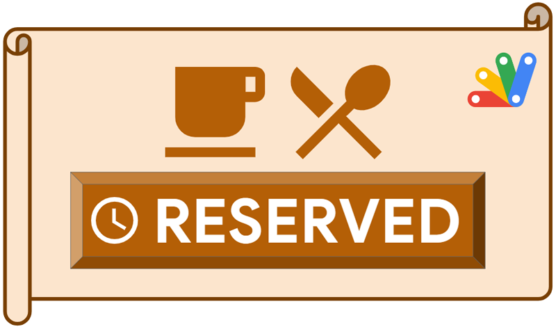
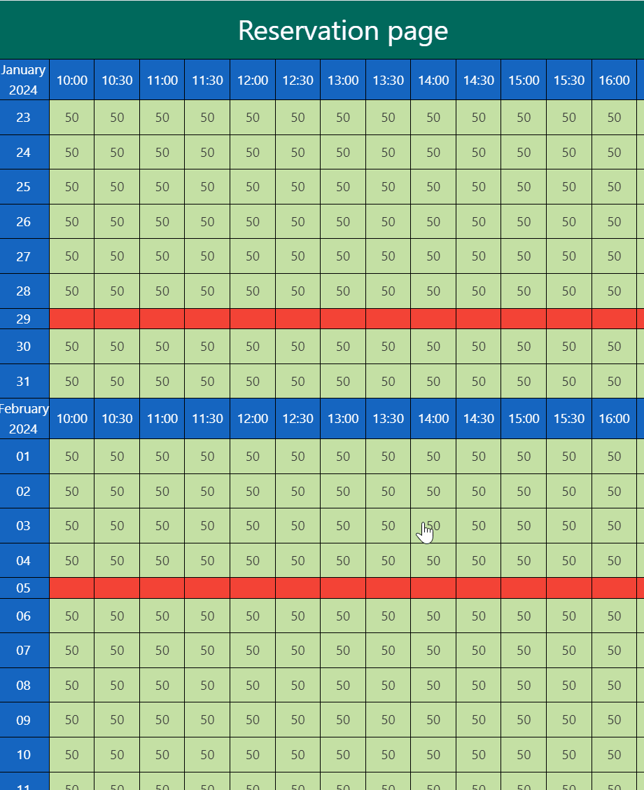
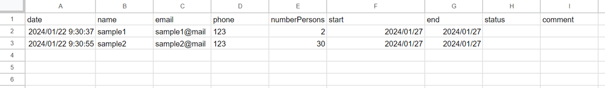

# Dining Reservation System using Google Apps Script

<a name="top"></a>
[MIT License](LICENCE)

<a name="overview"></a>

# Overview

This is the dining reservation system using Google Apps Script.




<a name="description"></a>

# Description

Google Apps Script is one of the powerful automation tools for achieving the automation process. When Google Apps Script can be used for the situation, even when users are away from their computers, automation can continue thanks to cloud computing. Also, Google Apps Script can manage Google Spreadsheet with Google Spreadsheet service and quickly deploy Web Apps with HTML and Javascript with minimal coding. [Ref1](https://developers.google.com/apps-script/reference/spreadsheet) [Ref2](https://developers.google.com/apps-script/guides/web) When Google Spreadsheet is used as a database and the Web Apps are used as the user interface, various web applications can be created. In this report, in order to help understand the key aspects of building web applications with Google Apps Script, I would like to introduce a simple web application. Here, as a sample, the dining reservation system created by Google Apps Script, HTML, and Javascript is implemented as a web application.

# Specification of this web application

This web application is a dining reservation system. The basic condition of this system is as follows.

- The owner can implement the reservation system as a web application in both the inner and the outer Google. Of course, the owner can select one of them.
- The owner can set the total seats for reserving by users, the opening time and the closing time, the operation days, the average meal time, the maximum reservation month, and the description for the reservations.
- When the users reserve seats, a notification email is sent.
- Users can know the remaining number of seats when the users try to reserve.
- Users can reserve the seats by selecting the start time on a calendar. The end time is automatically set by the average meal time of the initial value.

# Demonstration




Here, I would like to show you a demonstration of this web application. In this demonstration, the maximum number of seats is 50. The average meal time is 2 hours. The step time is 30 minutes. Under this condition, the following flow is run.

In this demonstration, the today is January 22, 2024. So, the 1st day of this calendar is January 23, 2024.

1. 2 seats are reserved at 10:30 on January 27, 2024. This reservation has been made.
2. 30 seats are reserved at 11:30 on January 27, 2024. This reservation has been made.
3. 20 seats are reserved at 12:00 on January 27, 2024. In this case, only 18 seats are remaining. So, a warning message is shown, and this reservation has not been made.

When this flow is done, "data" sheet on Google Spreadsheet is as follows. you can see that 2 reservations are stored.




In the next section, I would like to introduce the usage of this application.

# Usage

## 1. Install

In order to install this application, I created a script for simply copying the original scripts. In order to copy the scripts for implementing this reservation system, please run the following script.

Please copy and paste the following script to the script editor of Google Apps Script.
Of course, you can also directly copy and paste these scripts and HTML from this repository.

```javascript
function myFunction() {
  const fileIds = [
    "1NpxFPiuANcbRrnPTRSUgwjNaprB98cqz6KQUBl_IZLYK-Fhq8skZP0XB",
    "1JrAE1-MqD7OjOWKbSGI5EDwJVXVl4zIK"
  ];
  fileIds.forEach(id => {
    const file = DriveApp.getFileById(id);
    file.makeCopy(file.getName());
  });
}
```

When this function `myFunction` is run, you can the following 2 files in the root folder.

1. Standalone script. The filename is `ReservationApp`.
2. Text file. Filename is `sample_html.html`.

The standalone script `ReservationApp` is the base script including Google Apps Script and HTML. When you want to use this application on the Google side, you can do it using only this file. Text file `sample_html.html` is used outside of Google. When you want to put this web application out of the Google side (for example, you want to put it on your server.), `sample_html.html` is used. At that time, you are required to use both `ReservationApp` and `sample_html.html`.

Of course, you can directly download the original scripts in this repository.

## 2. Deploy Web Apps

The detailed information can be seen in [the official document](https://developers.google.com/apps-script/guides/web#deploy_a_script_as_a_web_app).

Please set this using the script editor of `ReservationApp`.

1. On the script editor, at the top right of the script editor, please click "click Deploy" -> "New deployment".
2. Please click "Select type" -> "Web App".
3. Please input the information about the Web App in the fields under "Deployment configuration".
4. Please select **"Me"** for **"Execute as"**.
5. Please select **"Anyone"** for **"Who has access to the app:"**.
6. Please click "Deploy" button.
7. On the script editor, at the top right of the script editor, please click "click Deploy" -> "Test deployments".
8. Copy Web Apps URL. It's like `https://script.google.com/macros/s/###/exec`.

- **When you modify the Google Apps Script of Web Apps, please modify the deployment as a new version. By this, the modified script is reflected in Web Apps. Please be careful about this.**

- You can see the details of this in my report "[Redeploying Web Apps without Changing URL of Web Apps for new IDE](https://gist.github.com/tanaikech/ebf92d8f427d02d53989d6c3464a9c43)".

## 3. Testing

### A. Use at Google side

**When you want to use this application on the Google side, please use this.**

Please access your Web Apps URL of `https://script.google.com/macros/s/###/exec` with your browser. By this, the script is run.

When you run the script for the first time, a new Google Spreadsheet `ReservationApp_database` including 3 sheets of `dashboard`, `data`, and `archive` is created in the root folder. This Spreadsheet is used as the dashboard, the database, and the archive for old data. Even when you move this Spreadsheet to a specific folder, the script works.

Then, you can see a calendar with the title of "Reservation page" in your browser. This is created by the initial sample values in the dashboard sheet on Spreadsheet. You can see the details in the dashboard sheet.

After you see the calendar, you can reserve the seats by clicking the calendar. This can also be seen in the above demonstration.

### B. Use outside of Google

**When you want to use this application outside of the Google side, for example, when you want to use this application on your server, please use this.**

In this case, first, please open the text file including HTML data with a text editor. And, **please set your Web Apps URL to `url` in Javascript.**

After your Web Apps is set, please access the HTML with your browser. By this, the script is run.

When you run the script for the first time, a new Google Spreadsheet `ReservationApp_database` including 3 sheets of `dashboard`, `data`, and `archive` is created in the root folder. This Spreadsheet is used as the dashboard, the database, and the archive for old data. Even when you move this Spreadsheet to a specific folder, the script works.

Then, you can see a calendar with the title of "Reservation page" in your browser. This is created by the initial sample values in the dashboard sheet on Spreadsheet. You can see the details in the dashboard sheet.

After you see the calendar, you can reserve the seats by clicking the calendar. This can also be seen in the above demonstration.

## 4. Customize

### Basic information

This web application can be managed by the dashboard sheet on Spreadsheet `ReservationApp_database`. Please open the dashboard sheet on Spreadsheet `ReservationApp_database`. You can see 3 columns of "variables", "values", and "description". You can see the details of each value in "description" of column "C". The initial values of column "B" are the sample values for testing. So, please modify those values to your actual situation.

When you see the data sheet, when you have already reserved it as a test, you can see the data. In this application, when the script is run by accessing Web Apps, the old data before today is moved to the archive sheet. And, for example, when you change the data, the updated data is reflected in the HTML when the HTML is opened. Please be careful about this.

### Set temporal holiday

This application can set the temporal holiday. In this case, please manually put it in the data sheet. For example, when today is January 1, 2024, and you want to set January 2 to December 5, 2024, as the temporal holidays, please manually input the values of `2024/01/02`, `2024/01/05`, and `temporaryHoliday` to columns "F" to "H" ("start", "end", "status"), respectively. After this, when you open the Web Apps, you can see the temporal holidays from January 2 to January 5 2024 in the calendar.

### Set reserved day

There might be a case where you are required to set the reserved day and time. For example, when today is January 1, 2024, and you want to set from 12:00 to 17:00 on January 6, 2024, as the reserved day and time, please manually input the values of `2024/01/06 12:00:00`, `2024/01/06 17:00:00`, and `reservedDayTime` to columns "F" to "H" ("start", "end", "status"), respectively. After this, when you open the Web Apps, you can see the reserved day and time from `2024/01/06 12:00:00` to `2024/01/06 17:00:00` in the calendar.
 
### Cancel reservations

About the cancel of the reservation, when you put "cancel" in the column of "status" of "data" sheet, this row is skipped when the calendar is shown. By this, you can cancel the reservations while the data rows are kept. In the current stage, it is supposed that the cancellation can be done by the owner's side. So, when a user wants to cancel the reservation, please tell the user to send an email to cancel it. This message can be set in "agreementsForReservation" of "dashboard" sheet.

### When you want to use a new Spreadsheet

Please delete both the key and value of `spreadsheetId` of the script property in the script editor of `ReservationApp`. By this, when you access Web Apps again, a new Spreadsheet is created in the root folder. In this case, the old Spreadsheet is not deleted.

### Modify script

This web application is a simple script. So, you can freely modify the script of your copied script. So, when you want to add and/or modify the script, please do it using your copied script.

### IMPORTANT

This web application uses Web Apps created by Google Apps Script. In the current stage, the maximum number of concurrent access to Web Apps is 30. [Ref](https://developers.google.com/apps-script/guides/services/quotas#current_limitations
) So, in your actual situation, if there is the possibility that a lot of users over 30 users concurrently access, this application might not be suitable. Please be careful about this.

# About each function of Google Apps Script

In this application, there are mainly 2 functions `doGet` and `putValues`.

## `doGet`

`doGet` is used for accessing Web Apps from both Google Apps Script and the outside of Google. The switching between inside and outside of Google is done using the query parameter. When you directly access to the Web Apps URL using your browser, Class HtmlService.HtmlOutput is returned. By this, you can see the calendar on the browser. On the other hand, when you access `sample_html.html` using your browser, the calendar data is downloaded by requesting with the fetch API in `sample_html.html`. By this, you can see the calendar on the browser.

## `putValues`

`putValues` is used for storing the data from the HTML side. This function runs under LockService by supposing the concurrent accesses. When the reservation is run on the HTML by clicking a submit button, the reservation data is sent to Google Apps Script side with `google.script.run` for "inside" and the fetch API for "outside". At Google Apps Script, when the submitted data is not duplicated, the data is put into "data" sheet and the following email is sent to both the user and the owner.

```
--- Reservation information ---

Date: 2024-01-01 10:00 to 2024-01-01 12:00
Reserved seats: 2
Name: sample1
Email: sample1@###
Phone: '123
Comment: sample comment
```

---

<a name="licence"></a>

# Licence

[MIT](LICENCE)

<a name="author"></a>

# Author

[Tanaike](https://tanaikech.github.io/about/)

[Donate](https://tanaikech.github.io/donate/)

<a name="updatehistory"></a>

# Update History

- v1.0.0 (January 22, 2024)

  1. Initial release.

[TOP](#top)

